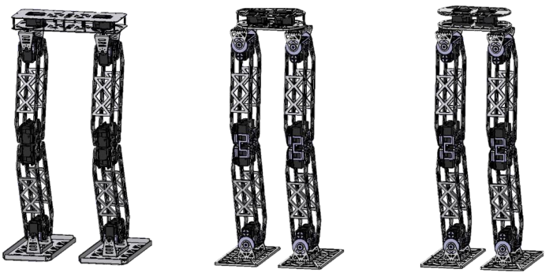
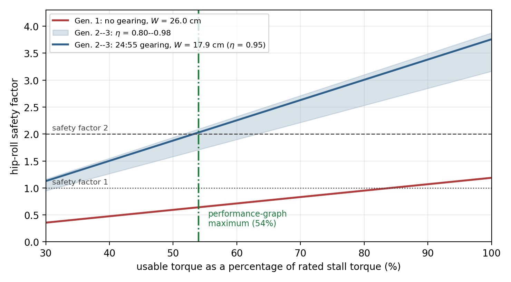
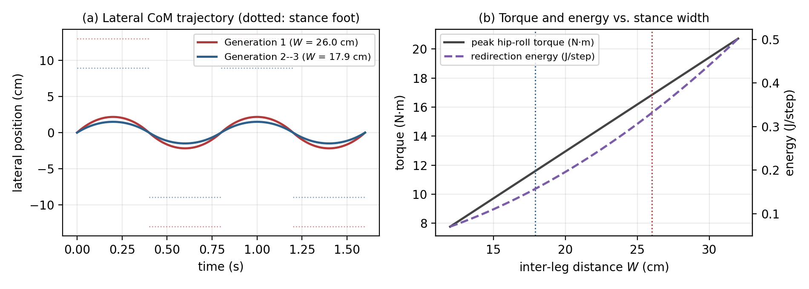
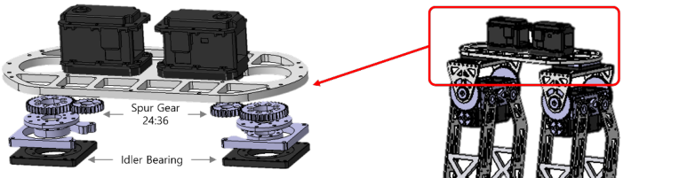
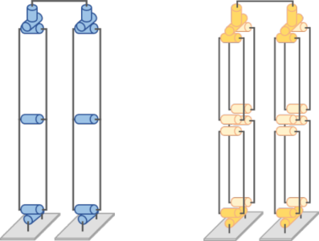

# Upgrading Humanoid Robot Mechatronics Without Replacing Actuators

Analysis code and data for a field-failure-driven redesign methodology, developed over three hardware generations of an adult-size humanoid robot contested in the RoboCup Humanoid League between 2017 and 2019.

Everything in this repository reproduces the analytical results of the accompanying paper from a single script, so that any assumption can be changed and its consequence seen immediately.

---

## The problem

An academic laboratory rarely rebuilds a humanoid robot from scratch. It upgrades one. And the upgrade is constrained in a specific way: the actuators dominate the cost of a leg, so replacing them with a higher-torque class is usually out of reach — and for a platform that students operate and that travels to competitions several times a year, a low-velocity self-locking actuator class is often *preferable* anyway, even where cheaper quasi-direct-drive alternatives exist.

So the question is not how to design a humanoid. It is how to improve one whose most expensive parameter is fixed.

<p align="center">
  <br>
  <em>Three generations of the same adult-size platform. Left: the first prototype, with joints mounted directly between actuator horn and link and a 26.0 cm stance. Centre: after Cycle 1 added per-axis gearing, flanged bearings, and a 17.9 cm stance. Right: after Cycle 2 replaced the hip-yaw bolt with an idler bearing.</em>
</p>

---

## The headline result

With the actuator model fixed, the first generation could not statically hold single support at all. Two modifications were applied — a 31 % reduction in stance width and per-axis external gearing — and **neither one is sufficient alone**.

| Configuration | Stance *W* | τ<sub>req</sub> | τ<sub>out</sub> | Safety factor |
|---|---:|---:|---:|---:|
| Gen. 1: as deployed | 26.0 cm | 16.83 N·m | 10.80 N·m | **0.64** |
| Transmission change only | 26.0 cm | 16.83 N·m | 23.51 N·m | 1.40 |
| Geometry change only | 17.9 cm | 11.59 N·m | 10.80 N·m | 0.93 |
| Gen. 2–3: as deployed | 17.9 cm | 11.59 N·m | 23.51 N·m | **2.03** |

The gear stage turns out to be *necessary*, not merely helpful. Setting τ<sub>out</sub> = τ<sub>req</sub> for an ungeared joint gives the widest stance it can hold, 16.7 cm — narrower than the 17.9 cm that swing clearance permits. No feasible geometry closes the deficit on its own.

---

## Does the conclusion depend on the assumptions?

Two parameters are not measurements of this platform: the spur-mesh efficiency, and how much of the actuator's rated stall torque is actually usable. Rather than pick one value for each, the budget is recomputed across the plausible range of both.

<p align="center">
  
</p>

The first generation reaches a safety factor of one only at 84 % of rated stall torque — a level the manufacturer's own performance graph does not reach. The second clears a factor of two at 53 %, essentially where the performance-graph maximum (54 %) sits, and holds above 1.7 even at a pessimistic mesh efficiency of 0.80.

**There is no combination of plausible parameter values under which the first configuration is adequate, and none under which the second is not.** That is the form the argument has to take when the platform can no longer be measured: a single computed number invites the objection that its inputs were assumed, whereas a range that brackets the inputs and yields the same decision throughout does not.

---

## Why narrowing the stance helps more than the static number suggests

<p align="center">
  
</p>

Peak hip-roll torque, sway amplitude, and centre-of-mass velocity at support exchange are all linear in stance width, so a 31 % reduction cuts each by 31 %. The energy that must be redirected at every support exchange scales with the *square* of stance width, and falls by 53 %.

| Measure | Gen. 1 (26.0 cm) | Gen. 2–3 (17.9 cm) | Change |
|---|---:|---:|---:|
| Peak hip-roll torque | 16.83 N·m | 11.59 N·m | −31 % |
| Lateral CoM sway amplitude | 2.17 cm | 1.49 cm | −31 % |
| CoM velocity at support exchange | 0.224 m/s | 0.154 m/s | −31 % |
| Step-to-step redirection energy | 0.331 J/step | 0.157 J/step | −53 % |
| Minimum CoM–foot lateral margin | 10.8 cm | 7.5 cm | −31 % |

The last row is the cost, not a benefit. Narrowing the stance buys torque margin by spending lateral stability margin.

---

## What actually happened in the field

<table>
<tr>
<td width="55%">

| Generation | Year | Matches | Failures | Incidence | 95 % CI |
|---|---:|---:|---:|---:|---|
| Gen. 1 | 2017 | 5 | 4 | 0.80 | [0.22, 2.05] |
| Gen. 2 | 2018 | 9 | 3 | 0.33 | [0.07, 0.97] |
| Gen. 3 | 2019 | 12 | 2 | 0.17 | [0.02, 0.60] |

</td>
<td>
<br>
<em>The Cycle 2 modification: an idler bearing replacing a single M8 bolt at the hip yaw.</em>
</td>
</tr>
</table>

Failure incidence fell monotonically while *exposure grew* — the platform survived further into each successive tournament, so the later generations had more opportunities to fail and recorded fewer failures.

**These counts are small and we report their uncertainty rather than the point estimates alone.** The exact Poisson intervals overlap, and the rate ratio between the first and third generations is 4.8 with a 95 % interval of [0.88, 26.2], which includes unity. The reduction is a consistent descriptive trend that corroborates the mechanical analysis; it is not independent statistical proof of it. Establishing the effect statistically would need an exposure that one team contesting one tournament a year cannot accumulate in three seasons.

---

## Running the analysis

```bash
pip install -r requirements.txt
cd analysis
python reproduce_analysis.py
```

This prints every analytical table in the paper and writes both analysis figures to `analysis/outputs/`.

All model parameters live in one `PARAMETERS` block at the top of `reproduce_analysis.py`. Change any of them and rerun to see the consequence — that is the point of publishing this rather than only the numbers.

---

## Repository layout

```
analysis/
  reproduce_analysis.py     all tables and figures, one file, no hidden state
data/
  failure_log_TEMPLATE.csv  structure for the per-match failure record
docs/
  manuscript_preprint.pdf   the accompanying paper
  images/                   figures used in this README
```

---

## What this repository is, and is not

It **recomputes predictions**. The platform has been retired from service, so no measurement was made for the paper. The torque budget, the frontal-plane analysis, and the velocity allocation are the same analytical predictions the methodology required *before* each redeployment, evaluated with documented parameters. The only empirical input is the archival failure record.

The two parameters most worth scrutinising are the usable torque per actuator (5.4 N·m, read from the manufacturer's performance graph at 12 V and used unscaled at 14.8 V, which is conservative) and the mesh efficiency (0.95, a handbook value for a single well-lubricated spur pair). Both are varied in the sensitivity analysis.

---

## The design rules

Four rules were extracted from the documented redesign cycles; two further entries codify practices that predate them. Every rule carries the condition under which it applies **and the property it degrades**, because a rule that travels without its cost will be misapplied.

| | Rule | Applies when | Cost |
|---|---|---|---|
| **R1** | Allocate transmission ratio per axis according to that axis's torque-versus-velocity demand | Axes differ in whether they hold load or generate motion | Added mass at every augmented joint; velocity budget ∝ *N*; reflected inertia ∝ *N*²; backlash at the mesh |
| **R2** | Reduce the load's moment arm before increasing capacity to bear it | The load is dominated by a lever arm that can be shortened | Reduces whatever margin the shortened dimension provided |
| **R3** | Carry load in bearings, not in fasteners | Any joint transmitting torsional or radial shock | Added mass and assembly complexity; raises structural but not torque capacity |
| **R5** | Match processor class to timing requirement, not to peak workload | Tasks differ by orders of magnitude in latency tolerance | Integration effort, inter-processor latency, added failure points |
| *R4* | *Remove actuated DoF that a mechanical constraint can reproduce* | *The lost freedom is not required by the task set* | *Reduced range of motion; the constraint linkage becomes a new load path* |
| *R6* | *Place dominant mass at the CoM and controllers at their buses* | *Any mobile platform with distributed actuation* | *Constrains structural layout; can conflict with thermal and service access* |

<p align="center">
  <br>
  <em>R4 in the hardware: the conventional six-joint serial leg (left) against the five-joint parallel structure (right), which omits the knee actuator and reproduces knee flexion through a parallelogram linkage.</em>
</p>

---

## Before you reuse this

If you are adapting the analysis to another platform, the parameters that matter most are in `PARAMETERS`, and the two assumptions worth re-deriving for your hardware are the usable torque and the mesh efficiency. The rules above are stated with their applicability conditions for the same reason.

---

## Citation

```bibtex
@article{yang2026upgrading,
  author  = {Yang, Jeehyun},
  title   = {Upgrading Humanoid Robot Mechatronics Without Replacing Actuators:
             A Field-Failure-Driven Redesign Methodology},
  journal = {Applied Sciences},
  year    = {2026},
  note    = {Manuscript}
}
```

This work extends a paper presented at the IASDR Congress, 2025. The platform itself is described in *Lightweight mechatronic system for humanoid robot*, The Knowledge Engineering Review 38, e5 (2023).

## License

Released under the MIT License. See `LICENSE`.
